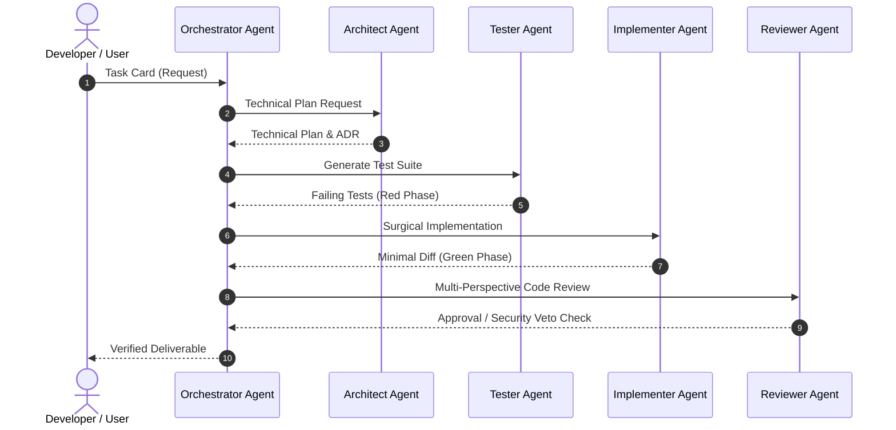

# 🤖 Caso de Estudio: CodeConductor (AI-Assisted Software Engineering Framework)

**Rol**: Creador & Principal Engineer  
**Dominio**: AI Engineering, Developer Tools, Multi-Agent Systems  
**Stack**: TypeScript / Node.js, Antigravity AGY Protocol, Markdown Agent Contracts  

---

## 🎯 1. Visión General & Objetivo

CodeConductor es un framework **Open Source** que transforma el *prompting* estocástico en un proceso de ingeniería determinista, seguro y reproducible. Coordina agentes de IA especializados mediante contratos estrictos y fases verificables.

---

## 🏗️ 2. Flujo de Ejecución (CCEP Protocol)

---

## 📋 3. Architecture Decision Records (ADRs)

### ADR-001: Protocolo CCEP (CodeConductor Execution Protocol)
- **Contexto**: Evitar alucinaciones, modificaciones masivas fuera de alcance y código no probado generado por LLMs.
- **Decisión**: Imponer un flujo rígido por fases con compuertas (*Gates*): `Parse` → `Resolve` → `Evaluate` → `Plan` → `Implement` → `Validate`.
- **Consecuencia**: Ningún cambio toca el código sin un plan aceptado y pruebas de verificación previas.

### ADR-002: Especialización de Agentes & Reglas YAGNI
- **Contexto**: Un solo prompt no puede actuar como arquitecto, programador y auditor simultáneamente sin perder calidad.
- **Decisión**: Dividir responsabilidades en sub-agentes aislados (`orchestrator`, `architect`, `implementer`, `tester`, `reviewer`, `security-reviewer`) con restricciones de herramientas (Read-only vs Write).
- **Consecuencia**: Alta calidad en auditorías y cambios quirúrgicos que cumplen con el principio YAGNI (You Aren't Gonna Need It).
