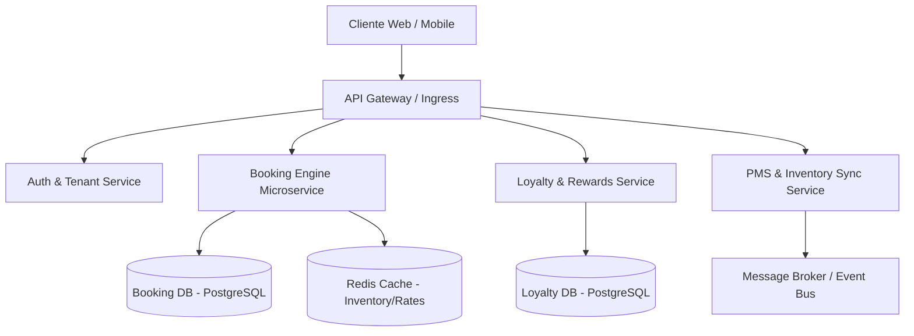

# 🏨 Caso de Estudio: Revenatium (Hospitality Platform & Direct Booking Engine)

**Rol**: Technical Leader & Software Architect  
**Dominio**: Hospitality, Travel Tech, Direct Channel & Loyalty Systems  
**Stack**: Spring Boot, Kotlin, Django, PostgreSQL, Redis, Docker, Microservicios  

---

## 🎯 1. Visión General & Problema de Negocio

Revenatium provee la infraestructura tecnológica necesaria para independizar a cadenas hoteleras e independientes de las OTAs (Online Travel Agencies), incrementando la conversión directa mediante:
- Motor de reservaciones directo en tiempo real con motor de disponibilidad y tarifas dinámicas.
- Plataforma de fidelidad y programas de lealtad con cashback y beneficios automatizados.
- Integración de pagos distribuidos y sincronización con PMS/Channel Managers.

---

## 🏗️ 2. Arquitectura del Sistema

---

## 📋 3. Architecture Decision Records (ADRs)

### ADR-001: Descomposición de Monolito a Microservicios por Dominio
- **Contexto**: El crecimiento de tráfico durante temporadas altas sobrecargaba el cálculo de disponibilidad de habitaciones afectando la liquidación de puntos de lealtad.
- **Decisión**: Desacoplar el dominio en microservicios independientes (`Booking Engine`, `Loyalty Service`, `Inventory Sync`) comunicados asíncronamente mediante eventos.
- **Consecuencia**: Escalabilidad horizontal independiente; los picos de búsqueda no degradan el sistema de lealtad ni el proceso de checkout.

### ADR-002: Estrategia de Aislamiento de Datos Multi-tenant
- **Contexto**: Garantizar el aislamiento estricto de los datos de cada cadena hotelera manteniendo eficiencia operativa.
- **Decisión**: Implementar *discriminator column strategy* con controles de autorización en capa de repositorio (Spring Data / JPA Hibernate filters) y esquemas aislados para clientes Enterprise.
- **Consecuencia**: Alta densidad de inquilinos con bajo consumo de infraestructura y la flexibilidad de migrar grandes cuentas a bases de datos dedicadas.

---

## ⚡ 4. Desafíos de Ingeniería & Métricas

- **Migración Zero-Downtime**: Migración exitosa de **70,000+ usuarios activos** y reservas históricas a la nueva arquitectura sin interrupción de servicio.
- **Eficiencia Operativa**: Reducción del **40% en tiempos operativos** mediante automatización de sincronizaciones de inventario.
- **Impacto de Negocio**: Incremento del **25% en suscriptores directos** y **60% de crecimiento en clientes corporativos**.
