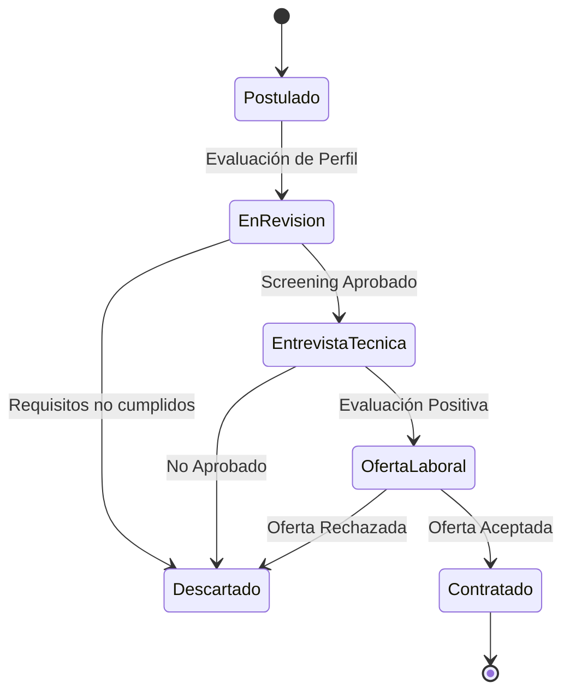

# 💼 Caso de Estudio: StarTalent (Applicant Tracking System & HR SaaS)

**Rol**: Software Architect / Tech Lead  
**Dominio**: HR Tech, Applicant Tracking Systems (ATS), SaaS  
**Stack**: Java, Spring Boot, React, PostgreSQL, Docker, AWS  

---

## 🎯 1. Visión General & Problema de Negocio

StarTalent es una plataforma SaaS integral para la gestión del talento y seguimiento de postulantes en procesos de reclutamiento masivos y ejecutivos.

---

## 🏗️ 2. Arquitectura del Embudo de Candidatos

---

## 📋 3. Architecture Decision Records (ADRs)

### ADR-001: Máquina de Estados Finita para la Transición de Candidatos
- **Contexto**: Las vacantes recibían miles de postulaciones; cambios desordenados de estado generaban inconsistencias en el embudo.
- **Decisión**: Implementar una máquina de estados explícita en Spring Boot para controlar las transiciones de estado de cada candidato con validación de permisos en cada paso.
- **Consecuencia**: Integridad total del embudo de reclutamiento y trazabilidad completa de auditoría para RRHH.

### ADR-002: Optimización de Búsqueda y Filtrado de Resúmenes
- **Contexto**: El filtrado por competencias sobre miles de currículums en base de datos relacional provocaba cierres de conexión (*timeouts*).
- **Decisión**: Diseñar índices compuestos especializados en PostgreSQL y consultas optimizadas para búsqueda avanzada por facetas de habilidades.
- **Consecuencia**: Tiempos de respuesta menores a **200ms** en búsquedas complejas dentro del SaaS.
